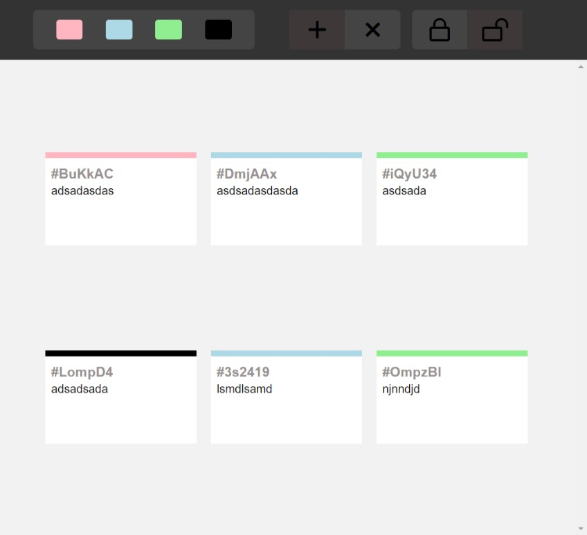

# Notes Management App

The aim of this project was to create a web app for managing notes and prioritizing the notes by color. 

## Features

1. Add new notes and give them a priority by assigning a color.
2. Delete the notes.
3. Lock/Unlock the notes to enable editing the content of the notes.
4. Filter the notes by color.
5. Change the priority of notes later by clicking on the header of notes.

## Screenshot

  

